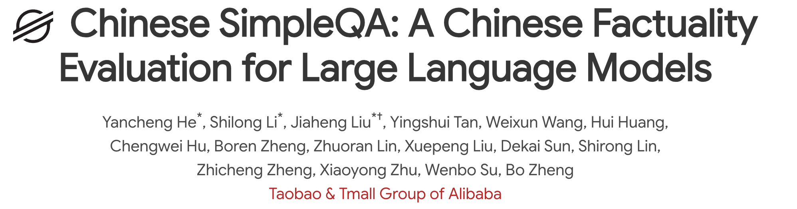

# Overview


<p align="center">
  
</p>
<p align="center">
   🌐 <a href="https://openstellarteam.github.io/ChineseSimpleQA/" target="_blank">网站</a> • 🤗 <a href="https://huggingface.co/datasets/OpenStellarTeam/Chinese-SimpleQA" target="_blank">Hugging Face</a> • ⏬ <a href="#data" target="_blank">数据</a> •   📃 <a href="https://huggingface.co/datasets/OpenStellarTeam/Chinese-SimpleQA" target="_blank">Paper</a> •   📊 <a href="http://47.109.32.164/" target="_blank">排行榜</a>  <br>  <a href="https://github.com/OpenStellarTeam/ChineseSimpleQA/blob/master/README_zh.md">   中文</a> | <a href="https://github.com/OpenStellarTeam/ChineseSimpleQA/blob/master/README.md">English 
</p> 


**Chinese SimpleQA**是首个简短事实问答能力的中文评测集，用于评估语言模型回答简短问题的真实性，主要有五个特点（即中文、多样化、高质量、静态、易于评估）。我们的基准涵盖**6 个主要主题**和**99 个多样化子主题**。

 可以访问我们的 [网站](https://openstellarteam.github.io/ChineseSimpleQA/) 或是 [论文](https://arxiv.org/abs/2411.07140) 得到更详细的信息。

<p align="center">
  
</p>


## 🆕 News

- **\[2024.11.18 soon]** 我们将发布一个全面且高质量的安全领域的QA评测集，敬请期待 🔥🔥🔥

- **\[2024.11.12\]** 我们发布了我们的数据和论文： Chinese SimpleQA dataset 🤗[huggingface](https://huggingface.co/datasets/OpenStellarTeam/Chinese-SimpleQA) 🚀🚀🚀

  

## 💫 Instroduction

* 如何解决模型的生成幻觉一直是人工智能（AI）领域的一个悬而未解的问题。为了测量语言模型的事实正确性，近期OpenAI 发布并开源了一个名为 SimpleQA 的评测集。而我们也同样一直在关注模型事实正确性这一领域，目前该领域存在数据过时、评测不准和覆盖不全等问题。例如现在大家广泛使用的知识评测集还是CommonSenseQA、CMMLU和C-Eval等选择题形式的评测集。为了进一步同步推进中文社区对模型事实正确性的研究，淘天集团算法技术-未来生活实验室团队提出了Chinese SimpleQA，这是第一个系统性地全面评估模型回答简短事实性问题能力的中文评测集，可以全面探测模型在各个领域的知识水平。具体来说，Chinese SimpleQA主要有六个特点：
  * 🀄**中文**：专注于中文语言，并特地包含中国文化等特色知识相关的问题
  * 🍀全面性：涵盖 6 个大类主题（中华文化、人文与社会科学、自然科学、生活艺术与文化、工程技术与应用科学、社会）和 99 个子类主题
  * ⚡**高质量**：我们进行了全面且严格的质量控制，有包括52位外包和6位算法工程师的参与
  * 💡**静态**：参考答案都是在时间上保持不变的，保证了评测集的长期有效性 ,可以长期作为模型知识能力的评估基准
  * 🗂️易于评估：评测数据的问题和答案非常简短，评测可以基于任意的模型，能够以较低成本和较快速度进行高一致性的评测。
  * 🐵**有难度和区分度**：我们评估了40+国内外开源和闭源大模型。目前在评测集上o1-preview都仅刚过及格线(正确率63.8)， 其他大部分模型都处于低分状态，其中GPT-4o mini仅37.6分，ChatGLM3-6B和Qwen2.5-1.5B仅11.2和11.1的准确率。

- 基于中文SimpleQA，我们对现有LLM的事实性能力进行了全面的评估。并维护一个全面的leaderboard榜单。同时我们也在评测集上实验分析了推理scaling law、模型校准、RAG、对齐税等研究问题，均有较明显的实验表现，后续本评测集都可以作为这些方向的重要参考之一。
- 总之，我们希望Chinese SimpleQA能帮助开发者深入了解其模型在中文领域的事实正确性，同时也能为他们的算法研究提供重要基石，共同促进中文基础模型的成长。


## 📊 Leaderboard

<p align="center">
  
</p>
详见：  [📊](http://47.109.32.164/)


## 🛠️ Setup

For [HumanEval](https://github.com/openai/human-eval/) (python programming)

```bash
git clone https://github.com/openai/human-eval
pip install -e human-eval
```

For the [OpenAI API](https://pypi.org/project/openai/):

```bash
pip install openai
```

For the [Anthropic API](https://docs.anthropic.com/claude/docs/quickstart-guide):

```bash
pip install anthropic
```


## ⚖️ Evals

我们提供了三种评测方式

(1) 第一种方式是基于openai发布的simple-evals框架. 启动命令如下: 

```bash
python -m simple-evals.demo
```


(2) 第二种方式是我们写的原生脚本，简单直接。运行步骤和命令如下: 

- 第一步: 在scripts/chinese_simpleqa_easy.py文件中设置openai key:

  ```
  os.environ["OPENAI_API_KEY"] = "replace your key here"
  os.environ["OPENAI_BASE_URL"] = "replace your key here"
  ```

- 第二步：运行下面的脚本启动评测：

  ```
  python judge/chinese_simpleqa_easy.py <model_name>
  ```

- 第三步：我们同样提供了同时处理多个模型结果的脚本，可以直接得到最终的leaderboard:

  ```
  python judge/get_leaderboard.py
  ```

(3) 我们同样将我们的评测集接入了 [OpenCompass](https://github.com/open-compass/opencompass)框架。你可以参照opencompass的脚本进行评测
- 第一步: 下载Opencompass:
  ```shell
  cd ~
  git clone git@github.com:open-compass/opencompass.git
  cd opencompass
  ```
- 第二步: 从huggingface下载Chinese Simpleqa，然后将chinese_simpleqa.jsonl放在OPENCOMPASS_PATH/data/chinese_simpleqa路径下
    ```
    ~/opencompass/data/
    └── chinese_simpleqa
        ├── chinese_simpleqa.jsonl
    ```
- 第三步: 参照configs/eval_chinese_simpleqa.py配置文件设置要评估的模型, 然后运行脚本
  ```
  python run.py configs/eval_chinese_simpleqa.py
  ```

## Citation

如果您使用了我们的数据集，请引用我们的论文。

```
@misc{he2024chinesesimpleqachinesefactuality,
      title={Chinese SimpleQA: A Chinese Factuality Evaluation for Large Language Models}, 
      author={Yancheng He and Shilong Li and Jiaheng Liu and Yingshui Tan and Weixun Wang and Hui Huang and Xingyuan Bu and Hangyu Guo and Chengwei Hu and Boren Zheng and Zhuoran Lin and Xuepeng Liu and Dekai Sun and Shirong Lin and Zhicheng Zheng and Xiaoyong Zhu and Wenbo Su and Bo Zheng},
      year={2024},
      eprint={2411.07140},
      archivePrefix={arXiv},
      primaryClass={cs.CL},
      url={https://arxiv.org/abs/2411.07140}, 
}
```

